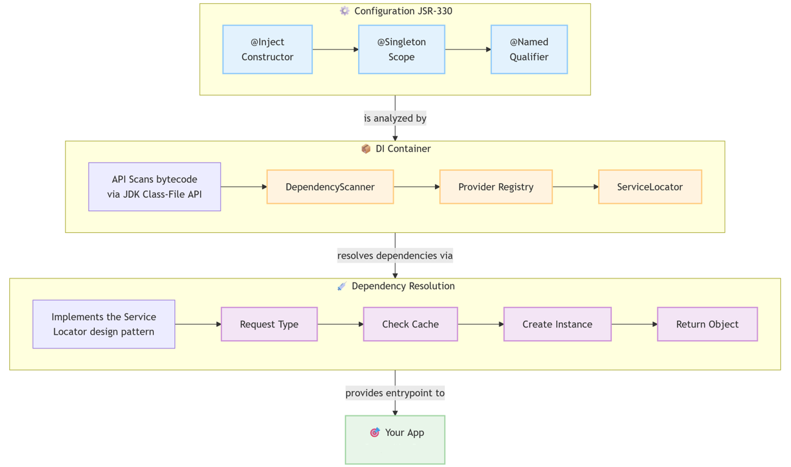

# Dimension-DI

Компактный, быстрый DI-фреймворк для Java с простой конфигурацией и внедрением зависимостей в runtime.

## Содержание

- [Почему Dimension-DI?](#почему-dimension-di)
- [Основная философия](#основная-философия)
- [Требования](#требования)
- [Установка](#установка)
- [Использование](#использование)
    - [1. Определите ваши компоненты](#1-определите-ваши-компоненты)
    - [2. Настройте и инициализируйте](#2-настройте-и-инициализируйте)
    - [Привязка интерфейсов и именованных реализаций](#привязка-интерфейсов-и-именованных-реализаций)
    - [Именованные реализации через @Named](#именованные-реализации-через-named)
    - [Пользовательские провайдеры (аналогично @Provides)](#пользовательские-провайдеры-аналогично-provides)
    - [Пропуск сканирования (только ручная настройка)](#пропуск-сканирования-только-ручная-настройка)
    - [Тестирование и переопределение](#тестирование-и-переопределение)
- [Как это работает](#как-это-работает)
    - [DependencyScanner](#dependencyscanner)
    - [DimensionDI.Builder](#dimensiondibuilder)
    - [ServiceLocator](#servicelocator)
- [Заметки о дизайне: DI против Service Locator](#заметки-о-дизайне-di-против-service-locator)
- [Ограничения](#ограничения)
- [Шпаргалка по API](#шпаргалка-по-api)
    - [Начальная загрузка (Bootstrap)](#начальная-загрузка-bootstrap)
    - [Получение в runtime (только в корне композиции)](#получение-в-runtime-только-в-корне-композиции)
    - [Ручная регистрация (в Builder)](#ручная-регистрация-в-builder)
    - [Утилиты](#утилиты)
- [Сравнительные таблицы](#сравнительные-таблицы)
- [Документация](#документация)
- [Контакты](#контакты)

Этот фреймворк обеспечивает внедрение зависимостей (DI) на основе аннотаций JSR-330 (jakarta.inject.*). Он автоматически
обнаруживает и связывает компоненты вашего приложения через внедрение в конструктор, используя сканирование classpath и
простую настройки конфигурации. Разработанный для простоты и быстрого запуска, он идеально подходит для небольших
приложений, микросервисов и инструментов, которым нужны преимущества DI без накладных расходов, связанных с более
крупными фреймворками, такими как Spring, Guice и Dagger 2.



## Почему Dimension-DI?

Dimension-DI — это легковесный, runtime-time контейнер для внедрения зависимостей, оптимизированный для производительности и простоты использования. Он предоставляет основные функции:

- **Основан на стандартах:** Использует JSR-330 (@Inject, @Named) для чистого кода с внедрением через конструктор.
- **Мощный и безопасный:** Поддерживает scope @Singleton, обнаружение циклических зависимостей и явную привязку для
  интерфейсов.
- **Быстрый и эффективный:** Использует сканирование classpath через JDK Class-File API (без загрузки классов) для
  быстрого запуска, без проблем работая как из директорий, так и из JAR-файлов.
- **Минимальные накладные расходы**: Никаких прокси, генерации байт-кода или магии во время выполнения — только простой,
  потокобезопасный сервис-локатор "под капотом", который вам никогда не придется использовать в вашей бизнес-логике.

## Основная философия

Dimension-DI следует двухэтапному подходу:

1. **Конфигурация на этапе сборки:** Гибкий API `Builder` используется для настройки DI-контейнера. Этот этап включает
   сканирование classpath на наличие компонентов, помеченных `@Inject`, анализ их зависимостей и регистрацию
   провайдеров (рецептов для создания объектов). Именно здесь проявляется "DI" часть.
2. **Разрешение во время выполнения:** Во время выполнения зависимости разрешаются с помощью внутреннего, глобально
   доступного `ServiceLocator`. Хотя реализация использует Service Locator, дизайн поощряет написание кода вашего
   приложения с использованием чистого **Внедрения через конструктор (Constructor Injection)**, отделяя ваши компоненты
   от самого DI-фреймворка.

## Требования

- Java 25+ с JDK Class-File API.

## Установка

Чтобы использовать Dimension-DI в вашем Maven-проекте, добавьте следующую зависимость в ваш `pom.xml`:

```XML

<dependency>
  <groupId>ru.dimension</groupId>
  <artifactId>di</artifactId>
  <version>${revision}</version>
</dependency>
```

## Использование

#### 1. Определите ваши компоненты

Создайте ваши сервисы и компоненты, используя стандартные аннотации `jakarta.inject.*`. Ваши классы не должны ничего
знать о Dimension-DI.

```Java
import jakarta.inject.Inject;
import jakarta.inject.Singleton;

@Singleton
class Config {

  String url() {
    return "https://api.example.com";
  }
}

class ApiClient {

  private final Config config;

  @Inject
  ApiClient(Config config) {
    this.config = config;
  }
}

class App {

  private final ApiClient api;

  @Inject
  App(ApiClient api) {
    this.api = api;
  }

  void run() {
  }
}
```

#### 2. Настройте и инициализируйте

Просканируйте ваши базовые пакеты и получите точку входа из ServiceLocator.

```Java
import ru.dimension.di.DimensionDI;
import ru.dimension.di.ServiceLocator;

public class Main {

  public static void main(String[] args) {
    DimensionDI.builder()
        .scanPackages("com.example")
        .buildAndInit();

    App app = ServiceLocator.get(App.class);
    app.run();
  }
}
```

Все зависимости разрешаются через внедрение в конструктор. Классы с аннотацией @Singleton кэшируются.

### Привязка интерфейсов и именованных реализаций

При внедрении интерфейсов добавьте привязку, чтобы контейнер знал, какую реализацию использовать.

```Java
import jakarta.inject.Inject;

interface Transport {

}

class HttpTransport implements Transport {

  @Inject
  HttpTransport(Config cfg) {
  }
}

class Service {

  @Inject
  Service(Transport transport) {
  }
}
```

Привяжите интерфейс к реализации.

```Java
import ru.dimension.di.DimensionDI;

public class Main {

  public static void main(String[] args) {
    DimensionDI.builder()
        .scanPackages("com.example")
        .bind(Transport.class, HttpTransport.class)
        .buildAndInit();
  }
}
```

### Именованные реализации через @Named

```Java
import jakarta.inject.Inject;
import jakarta.inject.Named;

interface Cache {

}

class RedisCache implements Cache {

  @Inject
  RedisCache(Config c) {
  }
}

class InMemoryCache implements Cache {

  @Inject
  InMemoryCache() {
  }
}

class Repository {

  @Inject
  Repository(@Named("fast") Cache cache) {
  }
}
```

```Java
import ru.dimension.di.DimensionDI;

public class Main {

  public static void main(String[] args) {
    DimensionDI.builder()
        .scanPackages("com.example")
        .bindNamed(Cache.class, "fast", InMemoryCache.class)
        .bindNamed(Cache.class, "durable", RedisCache.class)
        .buildAndInit();
  }
}
```

### Пользовательские провайдеры (аналогично @Provides)

Для объектов, которым требуется пользовательская логика создания (тяжелая инициализация, загрузка из файла/окружения и
т.д.)

```Java
import ru.dimension.di.DimensionDI;

public class Main {

  public static void main(String[] args) {
    DimensionDI.builder()
        .scanPackages("com.example")
        .provide(Config.class, ServiceLocator.singleton(() -> {
          {
          }
          return new Config();
        }))
        .buildAndInit();
  }
}
```

Используйте `ServiceLocator.singleton(supplier)` для кэширования результата.

```Java
import ru.dimension.di.DimensionDI;

public class Main {

  public static void main(String[] args) {
    DimensionDI.builder()
        .scanPackages("com.example")
        .provideNamed(Cache.class, "fast", ServiceLocator.singleton(InMemoryCache::new))
        .buildAndInit();
  }
}
```

### Пропуск сканирования (только ручная настройка)

Если вы не можете или не хотите использовать Class-File API.

```Java
import ru.dimension.di.DimensionDI;
import ru.dimension.di.ServiceLocator;

public class Main {

  public static void main(String[] args) {
    DimensionDI.builder()
        .provide(Config.class, ServiceLocator.singleton(Config::new))
        .provide(ApiClient.class, () -> new ApiClient(ServiceLocator.get(Config.class)))
        .provide(App.class, () -> new App(ServiceLocator.get(ApiClient.class)))
        .buildAndInit();
  }
}
```

### Тестирование и переопределение

Заменяйте реализации в тестах, не изменяя исходный код.

```Java
import ru.dimension.di.DimensionDI;
import ru.dimension.di.ServiceLocator;

class FakeApiClient extends ApiClient {

}

void setupTest() {
  DimensionDI.builder()
      .scanPackages("com.example")
      .provide(ApiClient.class, FakeApiClient::new)
      .buildAndInit();
}
```

Переопределение во время выполнения.

```Java

@Test
void runTest() {
  ServiceLocator.override(ServiceLocator.Key.of(ApiClient.class), FakeApiClient::new);
}
```

Сброс.

```Java

@Test
void runTest() {
  ServiceLocator.clear();
}
```

## Как это работает

### DependencyScanner

- Сканирует настроенные пакеты в поиске конкретных классов с:
    - конструктором с аннотацией `@Inject`, **или**
    - публичным конструктором без аргументов
- Считывает аннотацию `@Singleton` и реализованные интерфейсы
- Использует JDK Class-File API для анализа байт-кода без загрузки классов

### DimensionDI.Builder

- Создает карту провайдеров из результатов сканирования
- Добавляет ручные записи `bind` и `provide` (ручные переопределения имеют приоритет)
- Инициализирует ServiceLocator с провайдерами

### ServiceLocator

- Потокобезопасный реестр `Key -> Supplier<?>`
- Разрешает параметры конструктора по требованию (поддерживает `@Named`)
- Обнаруживает циклические зависимости и выбрасывает исключение с полезным стеком вызовов
- Кэширует синглтоны через `SingletonSupplier`
- **Утилиты**: `singleton`, `override`, `alias`, `clear`

**Примечание**: Провайдеры по умолчанию индексируются по конкретным классам. Интерфейсы требуют явной привязки через
`bind` или `bindNamed`.

---

## Заметки о дизайне: DI против Service Locator

- Вы пишете обычный код с внедрением через конструктор с помощью `@Inject`. Это соответствует принципам DI.
- Внутренне контейнер использует простой сервис-локатор `ServiceLocator` для разрешения зависимостей.
- **Лучшая практика**: вызывайте `ServiceLocator.get(...)` только в корне композиции (composition root), например, для
  получения вашего `App` верхнего уровня.

---

## Ограничения

- Поддерживаются только аннотации Jakarta Inject:
    - `@Inject` (конструкторы), `@Singleton`, `@Named` (на параметрах конструктора)
- **Пока не поддерживается**:
    - Внедрение в поля или методы
    - Пользовательские квалификаторы, кроме `@Named`
    - Assisted injection, `Provider<T>`, множественные привязки (коллекции), скоупы кроме singleton
- Сканирование использует JDK Class-File API.

---

## Шпаргалка по API

### Начальная загрузка (Bootstrap)

- `DimensionDI.builder().scanPackages(...).bind(...).provide(...).buildAndInit();`

### Получение в runtime (только в корне композиции)

- `ServiceLocator.get(MyRoot.class)`

### Ручная регистрация (в Builder)

- `.provide(type, supplier)`
- `.provideNamed(type, name, supplier)`
- `.bind(interface, impl)`
- `.bindNamed(interface, name, impl)`

### Утилиты

- `ServiceLocator.singleton(supplier)` — Кэширует экземпляр.
- `ServiceLocator.override(key, supplier)` — Заменяет провайдер во время выполнения.
- `ServiceLocator.alias(aliasKey, targetKey)` — Создает псевдоним для провайдера.
- `ServiceLocator.clear()` — Сбрасывает весь реестр.

## Сравнительные таблицы

### Таблица 1: Dimension-DI против "Большой тройки"

| Функция                              | Dimension-DI                                         | Spring IoC                                | Google Guice                     | Dagger 2                                  |
|--------------------------------------|------------------------------------------------------|-------------------------------------------|----------------------------------|-------------------------------------------|
| Стандарт аннотаций                   | JSR-330 (Jakarta)                                    | Spring-specific + JSR-330                 | JSR-330                          | JSR-330 + кастомные                       |
| Внедрение зависимостей               | Только через конструктор                             | Конструктор, поле, метод                  | Конструктор, поле, метод         | На основе конструктора                    |
| Кривая обучения                      | ⭐ Минимальная                                        | ⭐⭐⭐⭐⭐ Высокая                             | ⭐⭐⭐ Средняя                      | ⭐⭐⭐ Средняя                               |
| Производительность                   | ⭐⭐⭐⭐⭐ Высочайшая                                     | ⭐⭐ Низкая                                 | ⭐⭐⭐ Средняя                      | ⭐⭐⭐⭐⭐ Высочайшая                          |
| Время запуска                        | Сверхбыстрое                                         | Медленное                                 | Быстрое                          | Мгновенное (во время компиляции)          |
| Метаданные в runtime                 | JDK Class-File API                                   | Динамическая рефлексия                    | Динамическая рефлексия           | Нет (во время компиляции)                 |
| Генерация байт-кода                  | Нет                                                  | Интенсивное использование прокси          | Интенсивное использование прокси | Только во время компиляции                |
| Scope                                | @Singleton                                           | Request, Session, Singleton, Prototype    | Singleton, кастомные             | Singleton, кастомные                      |
| Поддержка @Singleton                 | ✅ Да                                                 | ✅ Да                                      | ✅ Да                             | ✅ Да                                      |
| Квалификаторы @Named                 | ✅ Да                                                 | ✅ Да                                      | ✅ Да                             | ✅ Да                                      |
| Пользовательские провайдеры          | ✅ `provide()`                                        | ✅ `@Bean`                                 | ✅ `@Provides`                    | ✅ `@Provides`                             |
| Внедрение в поля                     | ❌ Нет                                                | ✅ Да                                      | ✅ Да                             | ✅ Да                                      |
| Внедрение в методы                   | ❌ Нет                                                | ✅ Да                                      | ✅ Да                             | ✅ Да                                      |
| Коллекции/Multi-bind                 | ❌ Нет                                                | ✅ Да                                      | ✅ Да                             | ✅ Yes (@IntoSet/@IntoMap/…)               |
| Обнаружение циклических зависимостей | ✅ Да, явная ошибка                                   | ✅ Да                                      | ✅ Да                             | ✅ Во время компиляции                     |
| Система модулей/конфигурации         | Fluent Builder                                       | `@Configuration` + XML                    | Классы `Module`                  | Интерфейс `Component`                     |
| Поддержка тестирования               | ✅ Override, Clear                                    | ✅ Профили, моки                           | ✅ Переопределение привязок       | ✅ Тестовые компоненты                     |
| Сканирование JAR/директорий          | ✅ И то, и другое                                     | ✅ И то, и другое                          | Только вручную                   | Н/Д (во время компиляции)                 |
| Размер фреймворка                    | ~19 КБ                                               | ~30 МБ+                                   | ~782 КБ                          | ~47 КБ                                    |
| Лучше всего подходит для             | Микросервисы, утилиты, минимальные накладные расходы | Корпоративные приложения, полный веб-стек | Средние проекты, модульность     | Android, безопасность на этапе компиляции |
| Нулевая конфигурация                 | ✅ Полное сканирование classpath                      | ⚠️ Требует настройки                      | Ручная регистрация               | Настройка во время компиляции             |

---

### Таблица 2: Dimension-DI против альтернативных легковесных контейнеров

| Функция                              | Dimension-DI                 | PicoContainer                               | HK2                           | Avaje Inject                                |
|--------------------------------------|------------------------------|---------------------------------------------|-------------------------------|---------------------------------------------|
| Стандарт аннотаций                   | JSR-330                      | Только кастомные                            | JSR-330                       | JSR-330                                     |
| Легковесность                        | ✅ Сверхлегкий                | ✅ Очень легкий                              | ⚠️ Умеренный                  | ✅ Легкий                                    |
| Сканирование Classpath               | ✅ Class-File API             | ❌ Только вручную                            | ✅ Да                          | ✅ Да                                        |
| Внедрение через конструктор          | ✅ Только метод               | ✅ Да                                        | ✅ Да                          | ✅ Да                                        |
| Внедрение в поля                     | ❌ Нет                        | ✅ Да                                        | ✅ Да                          | ✅ Да                                        |
| Scope                                | @Singleton                   | Singleton                                   | Singleton, request, кастомные | Singleton, кастомные                        |
| Квалификаторы @Named                 | ✅ Да                         | ❌ Нет                                       | ✅ Да                          | ✅ Да                                        |
| Пользовательские провайдеры          | ✅ `provide()`                | ✅ Ручные фабрики                            | ✅ `@Factory`                  | ✅ `@Factory`                                |
| Обнаружение циклических зависимостей | ✅ Явная ошибка               | ❌ Ошибка времени выполнения                 | ✅ Да                          | ✅ Да                                        |
| Производительность                   | ⭐⭐⭐⭐⭐                        | ⭐⭐⭐⭐                                        | ⭐⭐⭐                           | ⭐⭐⭐⭐⭐                                       |
| Время запуска                        | Сверхбыстрое                 | Очень быстрое                               | Быстрое                       | Быстрейшее (во время компиляции)            |
| Рефлексия в runtime                  | Минимальная                  | Интенсивная                                 | Умеренная                     | Нет (во время компиляции)                   |
| Паттерн Service Locator              | ✅ Только внутренне           | ✅ Основная модель                           | ✅ HK2ServiceLocator           | ✅ Только внутренне                          |
| Модель компиляции                    | Сканирование в runtime       | Ручная регистрация                          | Сканирование в runtime        | Во время компиляции (APT)                   |
| Интеграция с Maven                   | ✅ Простая                    | ✅ Простая                                   | ✅ Простая (Jersey)            | ✅ Простая (APT)                             |
| Поддержка тестирования               | ✅ Override, Clear            | ✅ Rebind (перепривязка)                     | ✅ Да                          | ✅ Да                                        |
| Размер фреймворка                    | ~19 КБ                       | ~327 КБ                                     | ~131 КБ                       | ~80 КБ                                      |
| Активная разработка                  | ✅ Современная                | ⚠️ Неактивна                                | ✅ Активная                    | ✅ Активная                                  |
| Готовность к Jakarta Inject          | ✅ Полная                     | ⚠️ Частичная                                | ✅ Да                          | ✅ Да                                        |
| Лучше всего подходит для             | Микросервисы, быстрый запуск | Встраиваемые, кастомные, устаревшие системы | OSGi, модульные системы       | DI с проверкой на этапе компиляции, GraalVM |
| Версия Java                          | 25+                          | 8+                                          | 8+                            | 11+                                         |

## Документация

| EN                                | RU                                |
|:----------------------------------|:----------------------------------|
| [README на английском](README.md) | [README на русском](README-RU.md) |

## Контакты

Создано [@akardapolov](mailto:akardapolov@yandex.ru)